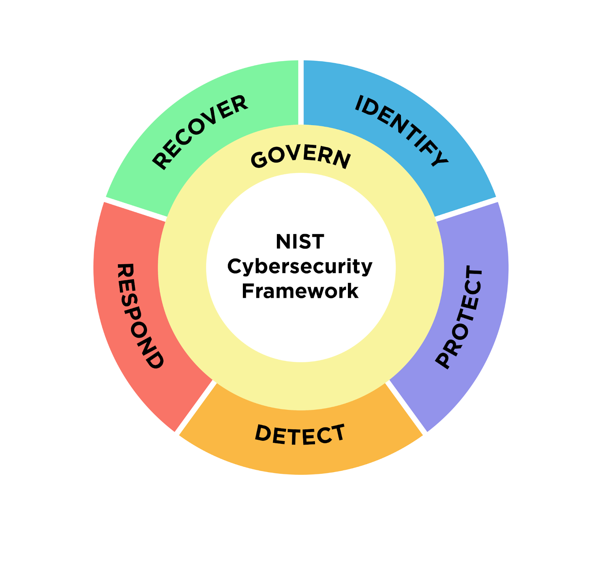

# Ethical Hacking Fundamentals and Threat Landscape Analysis

---

## 📌 Overview

This repository presents an analysis of ethical hacking principles and the modern cybersecurity threat landscape, particularly in financial institutions.

Ethical hacking helps organizations identify vulnerabilities before malicious attackers exploit them.

---

## 🖼️ Ethical Hacking Process

The ethical hacking lifecycle typically includes:

1. Reconnaissance
2. Scanning
3. Gaining Access
4. Maintaining Access (Testing Phase)
5. Reporting & Documentation

---

## 🛡️ What is Ethical Hacking?

Ethical hacking is the authorized and legal practice of testing systems, networks, or applications to discover security vulnerabilities.

### Key Principles:
- Legal authorization
- Defined scope
- Responsible disclosure
- Documentation of findings
- No misuse of data

Ethical hackers simulate real-world attacks to improve organizational security.

---

## ⚖️ Ethical Hacking vs Malicious Hacking

| Ethical Hacking | Malicious Hacking |
|-----------------|------------------|
| Legal & Authorized | Illegal & Unauthorized |
| Works within scope | No scope limitations |
| Reports vulnerabilities | Exploits vulnerabilities |
| Protects systems | Causes damage |
| Improves security posture | Financial and reputational harm |

---

## 🚨 Common Information Security Threats

| Threat | How It Works | Potential Impact | Example |
|--------|-------------|-----------------|----------|
| Phishing | Fake emails trick users into revealing credentials | Account compromise | Banking phishing scams |
| Malware | Malicious software infects systems | Data theft | Trojan infections |
| Ransomware | Encrypts files and demands payment | Operational shutdown | Major pipeline attacks |
| DDoS | Floods servers with traffic | Service disruption | Financial site outages |
| Insider Threat | Employees misuse access | Data leaks | Internal breaches |

---

## 🔐 Key Security Controls

### 1️⃣ Firewalls
Filters network traffic and blocks unauthorized access.

### 2️⃣ Multi-Factor Authentication (MFA)
Requires multiple identity verification steps.

### 3️⃣ Encryption
Protects data by converting it into unreadable format.

### 4️⃣ Intrusion Detection/Prevention Systems (IDS/IPS)
Monitors network traffic for suspicious activity.

### 5️⃣ Access Control Policies
Restricts system access based on user roles.

These controls reduce the likelihood and impact of cyberattacks.

---

## 🏦 Importance for Financial Institutions

Financial institutions handle highly sensitive data including:

- Customer financial information
- Personal identification data
- Transaction records

Ethical hacking ensures vulnerabilities are identified before attackers exploit them.

---

## 📊 Conclusion

Cyber threats continue to evolve rapidly. Ethical hacking plays a critical role in strengthening defenses and maintaining trust in financial systems.

Organizations that adopt proactive security testing significantly reduce cyber risk.

---

## 📚 References

- EC-Council – Ethical Hacking Overview  
- NIST SP 800-53 Security Controls  
- ISO/IEC 27001 Information Security Standard  

---

## 👨‍💻 Author

**Abhishek Pundir**  
Engineering Student | Aspiring Cybersecurity Professional  

---
